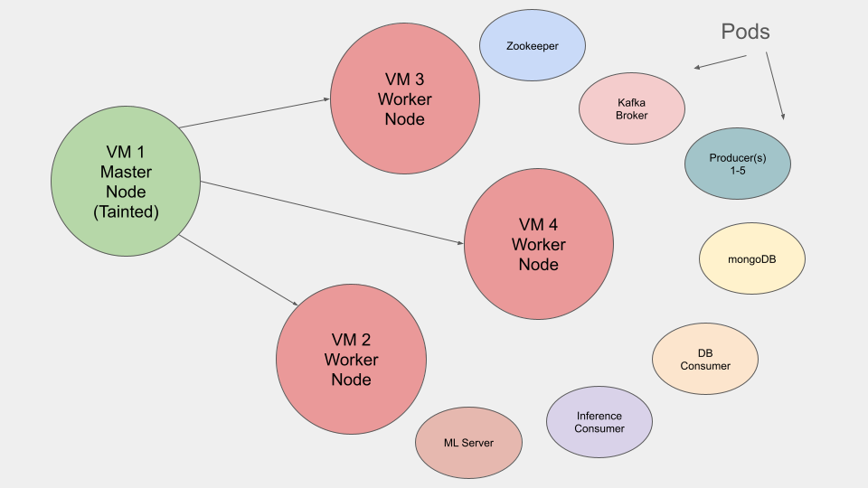
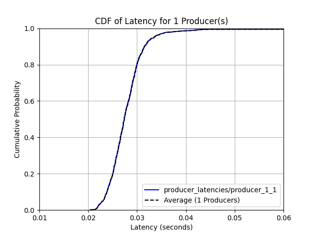
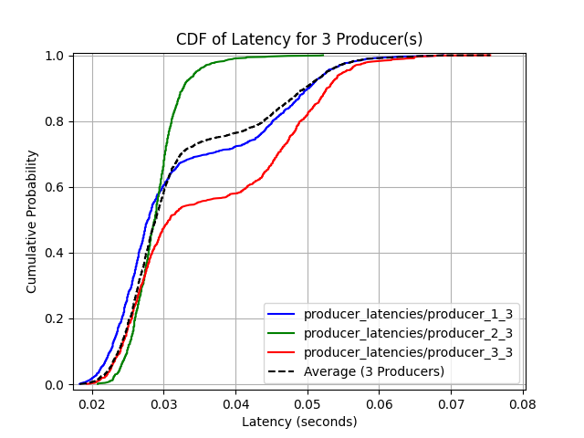
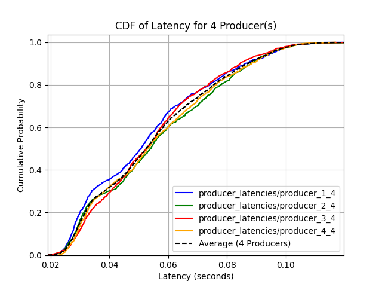
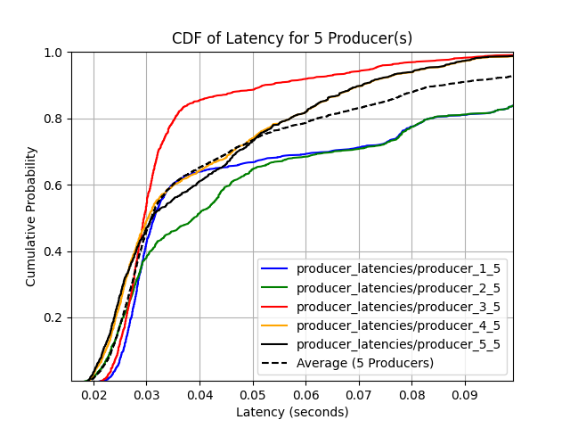

# CC-4278 Project 3 - Code Artifacts
**Team 14:** Maddox, Abhay, Emma

**LINK TO VIDEO** https://drive.google.com/file/d/1Z0Qeu5lTZHCjUctWOh7lLqmAqzNxsXGG/view?usp=sharing

## Virtual Machine 1: Master Node
- **Functionality:** Master node for the k8 cluster. Responsible for provisioning deployments and assigning tasks to worker nodes. 
- **Additional Services:** This node has been tainted so that it can also take on tasks like other worker nodes. 

## Virtual Machine 2-4: Worker Nodes
- **Functionality:**
  - Worker nodes for the k8 cluster. Host pods as prescribed by the master node

---

## `db-consumer pod`
- **File Hosted:**
  - db_consumer.py
- **Functionality:**
  - Acts as the DB Consumer, pulling image and inference data from Kafka topics.
  - Stores processed data in MongoDB to ensure organized data storage and accessibility.

---

## `inference-consumer pod`
- **File Hosted:**
  - consumer.py
- **Functionality:**
  - Connects with the ML inference server to obtain image classification results.
  - Serves as a bridge between the Kafka broker and the ML model for real-time data classification.
  - Sends to producers for timestamping

---

## `kafka-broker pod`
- **Functionality:**
  - Hosts the Kafka broker to facilitate message passing between producers and consumers.
  - Manages the `iot_images` and `inferences` topics for data relay across the pipeline.

---

## `ml-inference-server pod`
- **File Hosted:**
  - ml_server.py
- **Functionality:**
  - Runs a Flask server that accepts POST requests for image labeling.
  - Utilizes a pre-trained machine learning model to infer and label incoming images.
  - Communicates classification results to the `inference_consumer.py`

---

## `mongodb pod`
- **Functionality:**
  - Hosts MongoDB, serving as the primary database for the data pipeline.
  - Stores raw images and their respective inference results.
  - Allows data retrieval for analysis, supporting IoT and ML workflows.

---

## `multi-producer pods`
- **File Hosted:**
  - iot_producer.py
- **Functionality:**
  - Runs as individual producer jobs to simulate multiple data sources.
  - Generates and sends image data to the Kafka broker.
  - Aids in workload testing by scaling up the number of simultaneous data producers.

---

## Latency Experiment Results
- **One Producer:**
  - 
  - 90th percentile average latency: 0.03151 seconds
  - 95th percentile average latency: 0.0335 seconds
- **Two Producers:**
  - 
  - 90th percentile average latency: 0.053710000000000015 seconds
  - 95th percentile average latency: 0.056805 seconds
- **Three Producers:**
  - 
  - 90th percentile average latency: 0.04960999999999999 seconds
  - 95th percentile average latency: 0.05270499999999997 seconds
- **Four Producers:**
  - 
  - 90th percentile average latency: 0.08731 seconds
  - 95th percentile average latency: 0.09490499999999998 seconds
- **Five Producers:**
  - 
  - 90th percentile average latency: 0.08583000000000011 seconds
  - 95th percentile average latency: 0.10900500000000002 seconds

- The results of this experiment shows that increasing the number of producers interacting with our distributed system does indeed increase the latency between request and response for producers. While the increase is marginal, if we were to expand this to a larger number of VMs there would be a signifcant impact on latency
